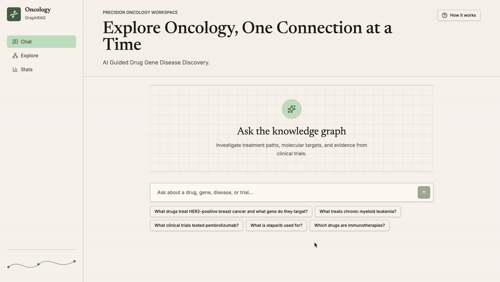
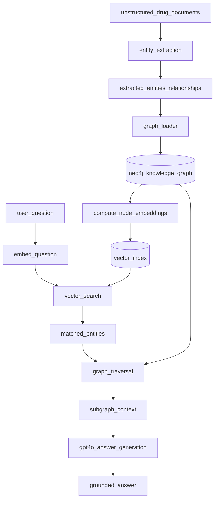

# 🧬 Oncology GraphRAG



A complete GraphRAG (Graph Retrieval-Augmented Generation) system built on an **oncology knowledge graph**. Ask questions about cancer drugs, gene targets, disease associations, and clinical trials in plain English — the system finds the answer by traversing a Neo4j graph of drugs, genes, cancer types, symptoms, and trials, then generates a grounded response via GPT-4o.

---

## Architecture



The entire graph is built from an LLM entity-extraction pipeline: plain-text drug monographs are read by GPT-4o and turned into structured drugs, diseases, genes, symptoms, trials, and the relationships between them — nothing is hardcoded. At query time, the question is embedded, matched against the graph via vector search, expanded through graph traversal, and answered by GPT-4o grounded only in the retrieved subgraph.

## Tech stack

- **Neo4j** — the knowledge graph (drugs, diseases, genes, symptoms, trials)
- **OpenAI GPT-4o** — entity extraction + answer generation
- **FastAPI** — backend API
- **Docker Compose** — one-command local setup

## Setup

```bash
git clone <repo-url>
cd oncology-graph-rag
cp .env.example .env
# add your OpenAI key to .env

docker compose up neo4j -d          # start the database

python -m venv venv && source venv/bin/activate
pip install -r requirements.txt

cd src
python entity_extraction.py         # extract structured data from unstructured docs
python loader.py                    # load the graph (built entirely from extraction output)
python embeddings.py                # compute vector embeddings

uvicorn api:app --reload --port 8000
```

## Example questions

- "What drugs treat HER2-positive breast cancer and what gene do they target?"
- "What treats chronic myeloid leukemia?"
- "What clinical trials tested pembrolizumab?"

## API endpoints

| Endpoint                      | Description                                 |
| ----------------------------- | ------------------------------------------- |
| `POST /ask`                   | Ask a question, get a graph-grounded answer |
| `GET /search`                 | Vector search over graph nodes              |
| `GET /graph/{entity}`         | Explore an entity's neighborhood            |
| `GET /drug/{name}/profile`    | Drug details                                |
| `GET /disease/{name}/profile` | Disease details                             |
| `GET /stats`                  | Graph node/relationship counts              |

## Project structure

```
oncology-graph-rag/
├── docker-compose.yml
├── Dockerfile.api
├── render.yaml
└── src/
    ├── db.py                  ← Neo4j connection
    ├── loader.py               ← loads data into Neo4j
    ├── entity_extraction.py    ← LLM extraction from unstructured docs
    ├── embeddings.py           ← vector embeddings
    ├── graphrag.py              ← the GraphRAG pipeline
    ├── api.py                  ← FastAPI backend
    └── data/
        ├── documents/           ← unstructured drug monographs (.txt), the only data source
        ├── extracted_data.json  ← structured output of entity_extraction.py
        └── fetch_oncology_data.py  ← optional: pulls live data from Open Targets / ClinicalTrials.gov
```
